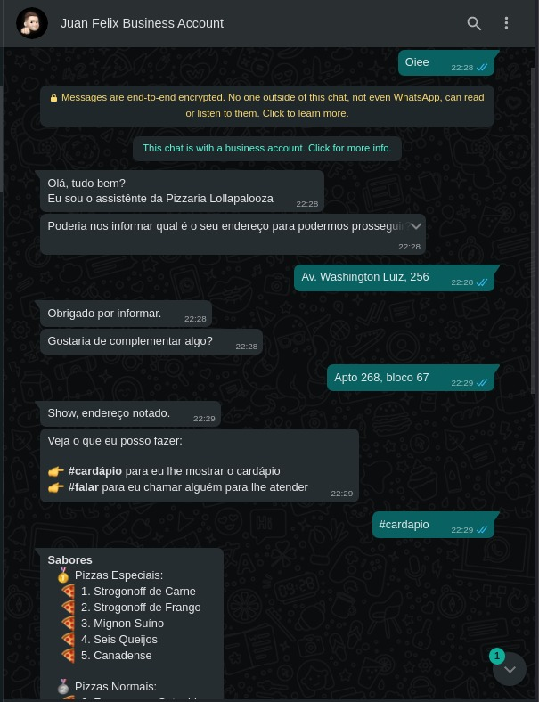

# BOT: Pizzeria Lollapalooza 🍕



## About

A simplified demonstration of an automated service automation with only responses from a fictitious pizzeria.The intention is to employ the quality to the service by adding scalability to the company's business.

## Installation 

Make sure you have installed on your machine the Node.js with 14 LTS or latest version, Yarn or NPM.

- First step: You should clone the repository on your workspace PC:
  ```shell
  git clone [repository-url]
  ```

- Second step: You should install project dependencies:
  - With *Yarn*
    ```shell
    yarn
    ```
  
  - With *NPM*
    ```shell
    npm install
    ```

## Execution 

- First Step: Execute the CLI command:
  - With *Yarn*
    ```shell
    yarn dev
    ```
  
  - With *NPM*
    ```shell
    npm run dev
    ```

- Second Step: Scan QR Code with Whats App Mobile:

  

You will now be able to answer messages automatically.

## License

MIT